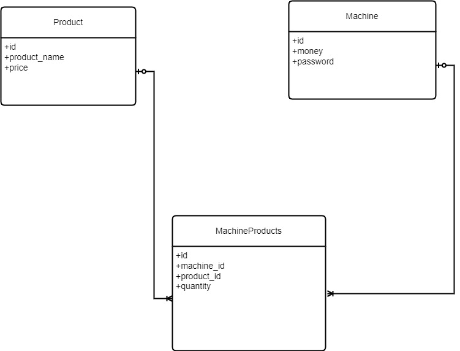

# Vending Machine

Fullstack Vending Machine Project with React.js and Java Spring Boot.

## Customize configuration

### Frontend Project Setup

Frontend React.js is built with Vite Configuration.

```sh
npm install
```

#### Compile and Hot-Reload for Development

```sh
npm run dev
```

#### Compile and Minify for Production

```sh
npm run build
```

### Database Setup

Change _server\src\main\resources\application.properties_ file username and password values with MySQL credentials.

### Backend Project Setup

Set Environment Variables
Add .env file into server folder with these properties

```properties
PROD_DB_HOST={DB_HOST}
PROD_DB_PORT={DB_PORT}
PROD_DB_NAME={DB_NAME}
PROD_DB_PASSWORD={DB_PWD}
PROD_DB_USERNAME={PB_USER}
```

Vscode launch configuration

```properties
{
    "type": "java",
    "name": "Spring Boot-ServerApplication<server>",
    "request": "launch",
    "cwd": "${workspaceFolder}",
    "mainClass": "com.example.server.ServerApplication",
    "projectName": "server",
    "args": "",
    "envFile": "${workspaceFolder}/.env"
}
```

## Database Entity Relations



## Backend Endpoints

### ProductController

<summary><code>GET</code> <code><b>/products</b></code> (get all products in the machine system)</summary>

<summary><code>PUT</code> <code><b>/products/{productId}</b></code> (update product price by id)</summary>

### MachineController

<summary><code>GET</code> <code><b>/machines/{machineId}</b></code> (get all necessary information in the start)</summary>

<summary><code>POST</code> <code><b>/machines/{machineId}</b></code> (check supplier panel login)</summary>

<summary><code>PUT</code> <code><b>/machines/{machineId}</b></code> (update machine current money)</summary>

### MachineProductsController

<summary><code>GET</code> <code><b>/machine-products</b></code> (get all machine products list)</summary>

<summary><code>GET</code> <code><b>/machine-products</b></code> (get machine products list by machine id parameter)</summary>

<summary><code>POST</code> <code><b>/machine-products</b></code> (update a product quantity in a machine if exists, else add one product to the machine )</summary>
